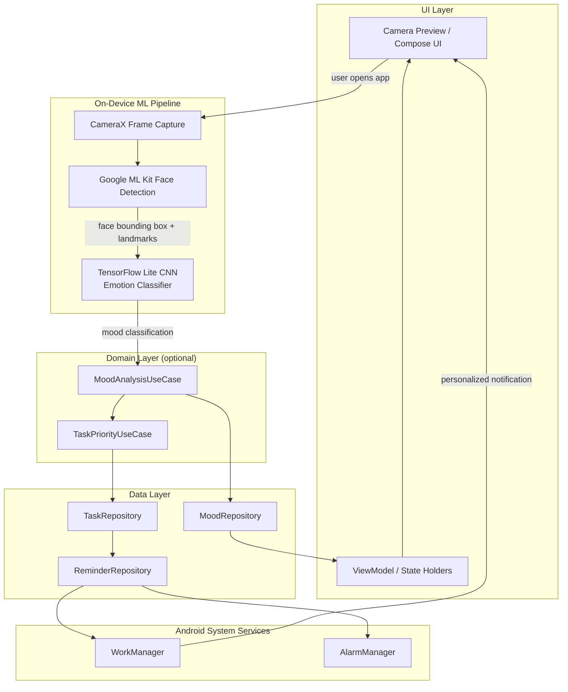
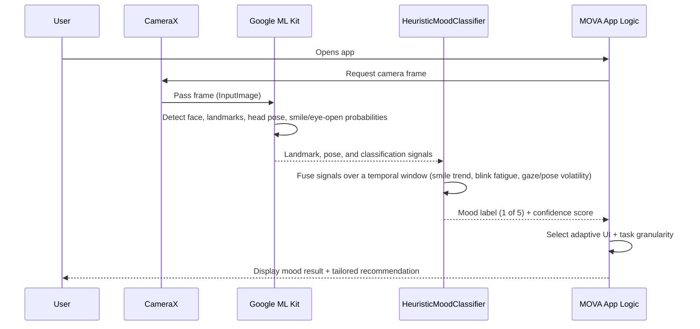
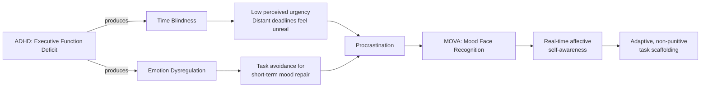

# MOVA

**Mood Face Recognition Android App for Individuals with ADHD & Procrastination**

MOVA is a native Android application that uses real-time, on-device facial expression analysis to detect a user's current mood, then delivers an adaptive visual feedback system designed to reduce task-initiation friction in individuals with ADHD. Unlike conventional productivity apps that treat procrastination as a scheduling problem, MOVA treats it as an emotional-regulation problem, grounded in peer-reviewed research on ADHD, procrastination, and affective computing.

> **Status:** Alpha Test, core mood-detection and feedback functionality is working; UI/UX and feature set are still under active refinement.

---

## Table of Contents

- [Background](#background)
- [System Architecture](#system-architecture)
- [Core Features](#core-features)
- [Tech Stack](#tech-stack)
- [XIME Library](#xime-library)
- [Data Flow: Mood Detection Pipeline](#data-flow-mood-detection-pipeline)
- [Theoretical Foundations](#theoretical-foundations)
- [Design References](#design-references)
- [Third-Party Software & Licenses](#third-party-software--licenses)
- [Project Status](#project-status)
- [Source Availability](#source-availability)
- [Roadmap](#roadmap)
- [References](#references)
- [License](#license)

---

## Background

Attention-Deficit/Hyperactivity Disorder (ADHD) is a neurodevelopmental disorder characterized by persistent patterns of inattention, hyperactivity, and impulsivity that do not align with an individual's developmental stage [1]. Longitudinal epidemiological studies indicate that a substantial proportion of individuals diagnosed with ADHD in childhood continue to experience clinically significant impairment into adulthood [1][2].

A defining functional consequence of adult ADHD is chronic procrastination. Rather than a matter of willpower, procrastination in ADHD populations is now understood through two convergent mechanisms:

- **Executive Function Deficit**, Barkley's model frames ADHD as a disorder of behavioral inhibition and self-regulation, in which deficits in non-verbal working memory produce *time blindness*: an impaired internal sense of elapsed and remaining time [3].
- **Short-Term Mood Repair**, Sirois & Pychyl reframe procrastination as an emotion-regulation strategy: when a task provokes anxiety, boredom, or a fear of failure, the brain defers the task to gain immediate affective relief, at the cost of long-term goals [4].

Emotion dysregulation and diminished self-esteem have been shown to statistically mediate the relationship between ADHD symptom severity and procrastination [5], and this cycle has been linked to elevated dropout intention among university students with ADHD symptoms [6].

Most commercial productivity apps (e.g., to-do lists, streak-based habit trackers) address the visible symptom, the undone task, without addressing its underlying emotional trigger. Gamified mechanics such as streaks have, in several studies, been shown to backfire for neurodivergent users, increasing shame and app abandonment after a single missed day [7].

MOVA's core hypothesis is that giving a user objective, real-time visibility into their own affective state, before they attempt a task, can short-circuit this avoidance loop, functioning as an external biofeedback mechanism for a population that often struggles to introspectively recognize its own emotional state in the moment [8].

This project originated as an undergraduate Final Project (Tugas Akhir) in the Visual Communication Design (DKV) program at Universitas Multimedia Nusantara (UMN), developed using a Design Thinking methodology (Empathize → Define → Ideate → Prototype → Test) [9].

## System Architecture

MOVA follows Android's recommended modern app architecture: a UI layer, an optional domain layer, and a data layer, with unidirectional data flow (UDF) [10].

*Figure 1. High-level system architecture, adapted from Android's recommended app architecture guidelines [10].*

## Core Features

| Feature | Description |
|---|---|
| **Mood Face Recognition** | On-device facial expression detection, run on app open, classifying the user's current affective state before any task list is shown. |
| **Adaptive Visual Feedback System** | Replaces static gamification (points, streaks, leaderboards) with a non-punitive, mood-responsive interface that adjusts tone and task granularity to the detected emotional state [7]. |
| **Daily Time Recognition** | Segments the day into contextual sessions (morning / focus / wind-down) to counter *time blindness*, adjusting productivity suggestions to the user's activity pattern [3]. |
| **Smart Reminder** | `WorkManager` / `AlarmManager`-based reminder system that times notifications to the user's mood and optimal time window, rather than firing on a fixed schedule [11]. |

> Feature set is still evolving during Alpha Test, see [Roadmap](#roadmap).

## Tech Stack

- **Language:** Java (100%, no Kotlin)
- **Platform:** Android (native SDK)
- **UI Framework:** [XIME](https://github.com/Xoeris/XIME), a custom open-source Android UI/Core library (see [XIME Library](#xime-library) below). All UI in MOVA is built on XIME components, e.g. `xime.ui.layout.LinearLayout`, rather than stock Android widgets.
- **Face Detection:** Google ML Kit Face Detection API [12]
- **Mood Classification (current Alpha):** A heuristic classifier that fuses ML Kit facial landmark, head-pose, and temporal signals (smile trend, blink/eye-openness, gaze/pose volatility) into a calibrated 5-mood probability distribution
- **Mood Classification (planned):** TensorFlow Lite CNN model, designed as a drop-in replacement behind the same classifier interface once trained [13]
- **Background Scheduling:** Android `WorkManager`, `AlarmManager` [11]
- **UI Architecture:** ViewModel / LiveData, lifecycle-aware components [10]

## XIME Library

MOVA's entire UI layer is built on **XIME**, a custom multi-module Android library authored independently of MOVA and planned for open-source release at [github.com/Xoeris/XIME](https://github.com/Xoeris/XIME). Every UI primitive in MOVA (layouts, views, dialogs, widgets) is a XIME subclass rather than a stock Android/AndroidX widget, e.g. `xime.ui.layout.LinearLayout` in place of `android.widget.LinearLayout`.

MOVA's app module depends on the following XIME modules:

| Module | Purpose |
|---|---|
| `XIME.Core` | Foundational utilities, logging, and shared infrastructure used across other XIME modules |
| `XIME.UI` | Custom layouts, views, dialogs, and widgets that replace stock Android UI components |
| `XIME.Animation` | Motion and transition primitives built on `dynamicanimation` |
| `XIME.Haptic` | Haptic feedback abstractions |
| `XIME.Graphics` | Custom drawing, shader, and blur effects, e.g. `LegacyBlur` |
| `XIME.Persistence` | Data persistence helpers layered on top of Room |

`XIME.Core` in turn depends on `XIME.AI` and Google Play Services Location. `XIME.Imaging` (an internal image-loading/caching module) is pulled in transitively via `XIME.UI`.

`XIME.AI` has now been reviewed: it is a pure-Java module (no Android SDK dependency, usable from Android, plain JVM, and Windows) implementing the client-side protocol, device registry, and local intent parsing for "Hyperion," an internal XIME AI subsystem. Its only external dependency is Gson.

> **Native ML dependency inside `XIME.Core`:** `XIME.Core` statically bundles [ncnn](https://github.com/Tencent/ncnn) (Tencent's neural network inference framework, BSD 3-Clause) with Vulkan GPU support, prebuilt for `arm64-v8a`, `armeabi-v7a`, `riscv64`, `x86`, and `x86_64`. This backs a native frame-interpolation engine (`rife_ncnn_bridge.cpp`, `lucine-interpolator.c`) modeled on [rife-ncnn-vulkan](https://github.com/nihui/rife-ncnn-vulkan) (MIT License), exposed to the Java layer as `xime.ui.utils.RifeFrameInterpolator` in `XIME.UI`, another MOVA dependency. Both licenses are permissive and copyleft-free, but since this native code and its prebuilt binaries are compiled into any app that links `XIME.Core`, MOVA includes it in its binary regardless of whether MOVA's own app code invokes it.

> **Scope note:** The broader XIME repository also contains `XIME.Media`, `XIME.Terminal`, `XIME.Tools`, and `XIME.Performance` modules, which are part of XIME as a standalone library but are **not** dependencies of MOVA's app module. `XIME.Terminal` and `XIME.Tools` in particular bundle third-party components under GPL/LGPL-family licenses (Android Terminal Emulator, BusyBox, erofs-utils, e2fsprogs). Since MOVA does not depend on these modules, they do not affect MOVA's own licensing.

## Data Flow: Mood Detection Pipeline

*Figure 2. Sequence of the mood-detection pipeline, from camera capture to adaptive UI response. Face detection follows Google ML Kit's on-device processing model [12]. The current Alpha build classifies mood via a multi-signal heuristic (`HeuristicMoodClassifier`) rather than a trained neural network; the classifier interface is designed so a TensorFlow Lite CNN model can be substituted behind it without changing the rest of the pipeline [13][14].*

All facial processing runs **on-device**. No image or video data is transmitted to an external server, consistent with ML Kit's on-device vision framework [12].

## Theoretical Foundations

MOVA's design is grounded in the following peer-reviewed frameworks:

- **Barkley's Executive Function / Behavioral Inhibition Model**, explains time blindness and self-regulation deficits in ADHD as downstream consequences of impaired behavioral inhibition [3].
- **Temporal Motivation Theory (TMT)**, models motivation as a function of Expectancy and Value divided by Impulsiveness × Delay, explaining why distant deadlines produce disproportionately low motivation in impulsive individuals [15].
- **Mood Repair Theory**, frames procrastination as a short-term emotion-regulation strategy rather than a time-management failure [4].
- **Non-Gamification Design**, evidence that streak-based and competitive gamification mechanics can increase psychological pressure and cause disengagement in neurodivergent users [7].

*Figure 3. Conceptual model linking ADHD-related executive/affective deficits to procrastination, and MOVA's intervention point. Synthesized from Barkley (2021) [3], Sirois & Pychyl (2016) [4], and Bodalski et al. (2023) [5].*

## Design References

The visual and interaction design of MOVA draws on the following reference material, originally compiled for the project's BAB II (Literature Review). Each image below is reproduced under fair use for educational/non-commercial documentation purposes, with full attribution to the original source.

### App Architecture

*Diagram of a typical app architecture: UI layer, optional domain layer, and data layer.*
**Source:** Android Developers, [Guide to app architecture](https://developer.android.com/topic/architecture) [10]

### Layout & Grid System

**Responsive layout grid (columns, gutters, margins)**
**Source:** Material Design, [Responsive UI](https://m2.material.io/design/layout/responsive-ui.html)

### Typography Scale

*Default type scale for Material Design 3, Display, Headline, Title, Body, Label, each in Large/Medium/Small.*
**Source:** Android Developers, [Material Design 3 in Compose](https://developer.android.com/develop/ui/compose/designsystems/material3)

### Color Harmony

**Color wheel, primary, secondary, and tertiary colors**
**Source:** Interaction Design Foundation, [What is Color Harmony?](https://ixdf.org/literature/topics/color-harmony) · © Interaction Design Foundation, CC BY-SA 4.0

### ADHD Executive Function Model

**Barkley's updated executive functioning conceptual model**
**Source:** Panah, M. T., Taremian, F., Dolatshahi, B., et al. (2022). *A comparison of Barkley's behavioral inhibition model (1997) with Barkley's updated executive functioning model in predicting adult ADHD symptoms.* Figure confirmed directly by R. Barkley via personal communication (Feb 2019). [ResearchGate](https://www.researchgate.net/figure/Barkleys-behavioral-inhibition-conceptual-model-Figure-2-Barkleys-updated-executive_fig1_366650671) [3]

### Temporal Motivation Theory

**Motivation curve: Expectancy × Value / (1 + Impulsiveness × Delay)**
**Source:** Steel, P., & König, C. J. (2006). *Integrating Theories of Motivation.* Academy of Management Review, 31(4), 889–913. https://doi.org/10.5465/AMR.2006.22527462 [15]

### Facial Action Coding System (FACS)

*Example Action Unit (AU12, Lip Corner Puller) from the Facial Action Coding System.*
**Source:** iMotions, [Facial Action Coding System (FACS): A Visual Guidebook](https://imotions.com/blog/learning/research-fundamentals/facial-action-coding-system/)

### CNN Architecture

*LeNet-5, an early convolutional neural network architecture illustrating the layered structure used in modern emotion-classification CNNs.*
**Source:** GeeksforGeeks, [Convolutional Neural Network (CNN) Architectures](https://www.geeksforgeeks.org/machine-learning/convolutional-neural-network-cnn-architectures/) [13]

### Google ML Kit Face Detection

**Face contour detection mesh example**
**Source:** Google Developers, [Detect faces with ML Kit on Android](https://developers.google.com/ml-kit/vision/face-detection/android) [12]

> **Note on image licensing:** Images reproduced above with a direct image link are hotlinked from their original source and displayed under fair use for academic documentation. Entries without a hotlinked image (Material Design layout grid, IxDF color wheel, Barkley's model, TMT curve, ML Kit contour mesh) are referenced by citation only, as their original hosts restrict direct embedding or require attribution formats incompatible with inline reproduction. Refer to each source link for the original visual.

## Third-Party Software & Licenses

MOVA uses the following third-party software:

1. **Google ML Kit Face Detection**
   Copyright Google LLC.
   Subject to [Google ML Kit / Google Developers Terms](https://developers.google.com/ml-kit) [12].

2. **TensorFlow / TensorFlow Lite**
   Licensed under the [Apache License, Version 2.0](https://www.apache.org/licenses/LICENSE-2.0) [13].
   Declared as a dependency for a planned CNN-based mood classifier; not yet invoked in the current Alpha build (see [Tech Stack](#tech-stack)).

3. **Google Play Services (Location, Auth)**
   Copyright Google LLC. Pulled in transitively via `XIME.Core`.

4. **ncnn**
   Copyright (C) 2017 THL A29 Limited, a Tencent company. Licensed under the [BSD 3-Clause License](https://github.com/Tencent/ncnn/blob/master/LICENSE.txt). Bundled as a prebuilt static library (with Vulkan support) inside `XIME.Core` for native frame interpolation; pulled in transitively via `XIME.Core`.

5. **rife-ncnn-vulkan (reference implementation)**
   Copyright (c) 2020 nihui. Licensed under the [MIT License](https://github.com/nihui/rife-ncnn-vulkan/blob/master/LICENSE). `XIME.Core`'s native RIFE bridge (`rife_ncnn_bridge.cpp`) is modeled on this project's approach to loading RIFE `.param`/`.bin` models via ncnn; pulled in transitively via `XIME.Core`.

Additional third-party dependencies (Room, Gson, CameraX, Glide, RxJava, Lottie, FastAdapter, and others) may carry their own licenses; consult `libs.versions.toml` and individual dependency documentation for full terms.

**XIME** is first-party code authored independently for reuse across projects (see [XIME Library](#xime-library)) and is not a third-party dependency. It is included here for completeness rather than in this list, as it is not owned by an external party.

## Project Status

MOVA is currently in **Alpha Test**. Core mood-detection and adaptive-feedback functionality is working, but:

- UI/UX is still being refined based on ongoing user testing
- Some features described in the research/design phase are not yet fully implemented
- Not recommended for production use or public distribution at this stage

## Source Availability

**This repository is closed-source.** The source code is private and not publicly cloneable or distributable. This README exists for documentation purposes only, to describe the project's background, architecture, and research grounding.

No installation, build, or clone instructions are provided, as the project is not open for public access at this time.

## Roadmap

- [ ] Complete Alpha testing and bug fixes
- [ ] Finalize adaptive visual feedback system logic
- [ ] Conduct specialist review (psychiatrist / clinical psychologist validation)
- [ ] Beta test / market validation
- [ ] Public release

## References

1. American Psychiatric Association. (2022). *Diagnostic and Statistical Manual of Mental Disorders* (5th ed., text rev.; DSM-5-TR). https://doi.org/10.1176/appi.books.9780890425787
2. Ayano, G., Tsegay, L., Gizachew, Y., et al. (2023). Epidemiology of attention-deficit/hyperactivity disorder: A systematic review and meta-analysis. *Middle East Current Psychiatry*. https://doi.org/10.1186/s12991-023-00440-2
3. Barkley, R. A. (2021). *Taking Charge of Adult ADHD*. Guilford Press. Model diagram (updated executive functioning model) reproduced/adapted in: Panah, M. T., Taremian, F., Dolatshahi, B., et al. (2022). A comparison of Barkley's behavioral inhibition model (1997) with Barkley's updated executive functioning model in predicting adult ADHD symptoms. https://www.researchgate.net/publication/366650671
4. Sirois, F., & Pychyl, T. (2016). *Procrastination, Health, and Well-Being*. Academic Press.
5. Bodalski, E. A., et al. (2023). ADHD symptoms and procrastination: The role of emotion dysregulation and self-esteem. *Journal of Attention Disorders*. https://doi.org/10.1177/10870547231187421
6. Müller, M., et al. (2024). Psychological consequences of chronic procrastination: A systematic review. *Clinical Psychology Review*. https://doi.org/10.1016/j.cpr.2024.102387
7. Turgeman, L., & Pollak, Y. (2023). Using the temporal motivation theory to explain procrastination among adults with ADHD symptoms.
8. Bozkurt, A., et al. (2024). Emotion dysregulation and impulsivity in adults with ADHD: A systematic review. *Journal of Psychiatric Research*. https://doi.org/10.1016/j.jpsychires.2023.12.010
9. Dam, R., & Siang, T. (2021). Design Thinking: A 5 stage process. Interaction Design Foundation. https://www.interaction-design.org/literature/article/5-stages-in-the-design-thinking-process
10. Android Developers. (2026). Guide to app architecture. https://developer.android.com/topic/architecture
11. Android Developers. (2024). Schedule alarms with AlarmManager. https://developer.android.com/develop/background-work/services/alarms/schedule
12. Google Developers. (2026). Detect faces with ML Kit on Android. https://developers.google.com/ml-kit/vision/face-detection/android
13. GeeksforGeeks. (2025). Convolutional Neural Network (CNN) Architectures. https://www.geeksforgeeks.org/machine-learning/convolutional-neural-network-cnn-architectures/
14. Savchenko, A. (2023). Facial expression recognition with adaptive frame rate based on multiple testing correction.
15. Steel, P., & König, C. J. (2006). Integrating Theories of Motivation. *Academy of Management Review*, 31(4), 889–913. https://doi.org/10.5465/AMR.2006.22527462

## License

This project is **closed-source and proprietary**. All rights reserved unless otherwise stated. Third-party components remain subject to their respective licenses as listed above.
